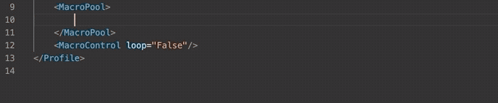

## Features

Snippets for VS Code designed to help create macros for the ATEM line of video production switchers from Blackmagic Design.

## How to Use

* Install [ATEM Macro Snippets from the VS Code Marketplace](https://marketplace.visualstudio.com/items?itemName=bryceseifert.atem-macro-snippets&ssr=false#review-details).
* Create a new XML file (or alternatively, edit an XML file exported from ATEM Software Control)
* Start to type a macro you want to add and suggestions will appear. A full list of included options is available below
* Select your snippet!
* Using the tab key, navigate through the snippet. There will either be dropdowns featuring selectable options, or placeholders which allow you to type your own value.
* Once a property is selected, the snippet will also automatically update properties that appear later in the code
* Continue using the tab key and selecting or entering values until the cursor is at the end of the block

## Included Macro Presets (Alphabetical)

* Audio Controls
    * Master Fader Gain
    * Master Fader AFV
* AUX Outputs
* Capture Still
* Color Generators
* DSK Controls
* DVE Transition Settings
* FTB (Fade to Black)
* Hyperdeck Controls
* Keys
    * On Air
    * Type
    * Fill Input
    * Key Input
    * Masks
    * Advanced Chroma Key
    * Luma Key
    * Pattern Key
    * DVE / Fly Key
* Macro Controls
    * Pause
    * User Wait
* Media Players
* Preview / Program Input
* Profiles (these are helpful when starting XML files from scratch)
    * ATEM Mini
    * ATEM 1 M/E Production Studio
    * ATEM 2 M/E Production Studio 
    * ATEM 4 M/E Broadcast Studio
* SuperSource
* Transition Controls
    * AUTO
    * CUT
    * Direction
    * Flip/Flop
    * Mix Rate
* Wipe Transition Settings

## Requirements

It is recommend that you are running the [latest version of ATEM Software Control](https://www.blackmagicdesign.com/support/family/atem-live-production-switchers).

## Latest Release: 1.1.3

* Added ATEM Constellation profile

View [Changelog](https://github.com/bryce-seifert/ATEM-Macro-Snippets/blob/master/CHANGELOG.md) for previous releases